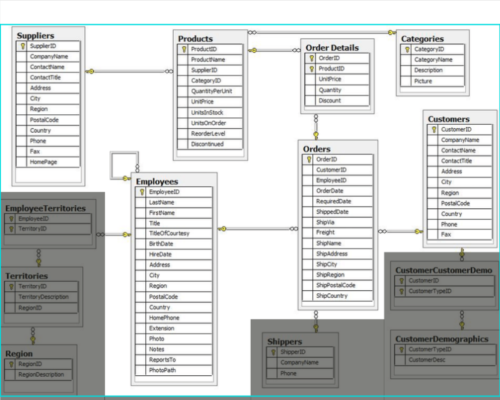
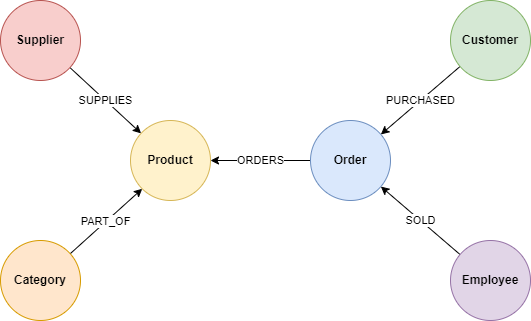

Lately I have been getting into Clojure a bit and what better way to learn a new language than by using it. So I
thought, what project should I take up that would also include my interest in graph technologies and query languages.
And then Iremembered that I had actually already been briefly acquainted with Clojure. At work,we came across an
interesting database called
XTDB a general purpose bitemporal database written entirely in Clojure that uses Datalog as it’s main query language. So
the idea for the post came to be – why don’t I just do a comparison of two languages capable of efficiently querying
graphs & do a bit of programming in Clojure at the sametime.
We will compare two query languages:

- _Cypher_ a declarative graph query language that allows for expressive and efficient data querying in a property
  graph. With Cypher, use ASCII art to describe the “shape” of the subgraph we are looking for in the data.
- _Datalog_ a declarative database query language with roots in logic programming.The idea for Datalog is to query data
  by providing a partial specification of rules or facts, and then let the database find all instances of the
  specification implied bythese rules.

If you want to learn more about Cypher or Datalog, make sure to check out some sources provided at the end of the post.
We will run queries against the infamous Northwind dataset. It depicts a product sale system – storing and tracking
customers, products, customer orders, warehouse stock,shipping, suppliers, and even employees.
Although the Northwind data set is often used to demonstrate SQL and relational databases, we can also structure the
data as a graph.
For our purposes, we will use a subset of the dataset (as shown in the figure below).



# Import to Neo4j

Neo4j stores data in a property graph, so we have to transform tables into nodes and relationships. For this example it
is pretty straight forward, we turn table rows into nodes and joins to relationships. We get the following graph data
model.
If you want to learn more about how to import relational data into Neo4j I recommend to check out their official
tutorial.



# Import to XTDB

Importing data to XTDB is even easier since it is a schemaless document database.
We import every table row as a separate document (a document is a map from keywords to values). The database then
automatically indexes top-level fields of documents to enable efficient joins and retrievals.
Example of a document (in EDN format) that represents one product:

```edn
{
  :xt/id #uuid "00781204-3ce4-4c72-93ec-08300afec31f"
  :unitsOnOrder 0
  :supplierID 12
  :productName "Original Frankfurter grüne Soße"
  :categoryID 2
  :reorderLevel 15
  :productID 77
  :discontinued 0
  :quantityPerUnit "12 boxes"
  :unitsInStock 32
  :unitPrice 13.00
}
```

In XTDB each document must contain the `:xt/id` key. For the sake of simplicity, we used random uuids.
Ok, so now that we have prepared our dataset, we can finally query it. Let’s start with an easy query, just to get the
feel of both languages. We will explain it step-by-step (if you wish to run queries on your own, the source code is
available
here).

# Queries

## Which category is product ‘Chocolade’ part of?

### Cypher

```cypher

MATCH (:Product {productName: 'Chocolade'})-[:PART_OF]->(category:Category)
RETURN category.categoryName AS categoryName
```

In Cypher we use text to provide a visual representation of the pattern that we want to match in our graph.
The query is explained as follows:

1. We start with the keyword `MATCH` which indicates that we want to search for a pattern in a graph.
2. Following is a pattern `(:Product {productName:'Chocolade'})-[:PART_OF]->(category:Category)` indicating that we are
   looking for a `Product`node with name
   "Chocolade" and then traverse from it over the `PART_OF` relationship to the `Category` node.
3. At the end of the query is a `RETURN` clause whic h defines what to include in the query result set. In our case, we
   want to get the name of the category.

### Datalog

```
{:find [?category-name] 
 :where [[product :productName "Chocolade"] 
         [product :categoryID category-id] 
         [category :categoryID category-id] 
         [category :categoryName ?category-name]]}
```

In Datalog, queries are written in EDN format (the same way documents are stored). We won’t go into details about the format, 
all you have to know is that it is similar to JSON. In the simplest form, a query is represented with two key-value pairs. 
In the first pair,where the key is `:find` and the value is a vector of one or more variables, we define what values form 
the result of the query. The other key-value pair is the `:where` keyword, with a vector of clauses that restrict the query to match the specified pattern.
In Datalog, patterns are describes with triple clauses. A triple clause is a vector of (1) a literal document ID or logic variable, (2) a top-level key 
in a document and (3) a literal or logic variable.

Let’s go step by step over the query:

1. In the `:find` clause, we specify that we want to return the `?category-name` variable.
2. In the `:where` clause, we start with:
    1. `[product :productName "Chocolade"]` – match documents with
       :productName equal to "Chocolade" and bind them to the variable product.
    2. `[product :categoryID category-id]` – match documents product that have
       an attribute :categoryID and bind the value of the attribute to variable
       `category-id.
    3. `[category :categoryID category-id]` – match documents that have an
       attribute :categoryID and value equal to variable `category-id`. Bind
       documents to category variable.
    4. `[category :categoryName ?category-name]` – match documents category that have an attribute `:categoryName` and bind the value of the attribute to
       variable `?category-name`

Note that variables product and category are used in multiple data patterns. When a
variable is used in multiple places, XTDB requires it to be bound to the same value in
each place. Therefore, this query will only find a product with name Chocolade check
its `categoryID` value and match the category with the same id. The order of the data
patterns does not matter. XTDB ignores clause ordering, so the query engine can
optimise query execution. If we run both queries, we get that product with name
Chocolade is part of Confections category.

Now that we have a basic idea of how Cypher and Datalog queries look like, we can
move to the next ones.

## Get all suppliers of categories

### Cypher

```
MATCH (supplier:Supplier)-->(:Product)-->(category:Category)
RETURN supplier.companyName as company, collect(distinct
category.categoryName) as categories
ORDER BY company ASC
```
### Datalog

```
{:find [?company (distinct ?category-name)]
 :keys [supplier supplied-categories]
 :order-by [[?company :asc]]
 :where  [[product :supplierID supplier-id]
         [product :categoryID category-id]
         [company :supplierID supplier-id]
         [company :companyName ?company]
         [category :categoryID category-id]
         [category :categoryName ?category-name]]}
```
## Find the suppliers of products in the produce category

### Cypher

```
MATCH (:Category {categoryName: "Produce"})<--(:Product)<--
(supplier:Supplier)
RETURN DISTINCT supplier.companyName as produceSuppliers
```
### Datalog
```
{:find [(distinct ?produce-supplier)]
 :keys [produce-suppliers]
 :where [[category :categoryName "Produce"]
         [category :categoryID category-id]
         [product :categoryID category-id]
         [product :supplierID supplier-id]
         [supplier :supplierID supplier-id]
         [supplier :companyName ?produce-supplier]]}
```

## How are employees organised? Who reports to whom?

### Cypher

```
MATCH (employee:Employee)<-[:REPORTS_TO]-(subEmployee)
RETURN employee.firstName + ' ' + employee.lastName AS manager, subEmployee.firstName + ' ' + subEmployee.lastName AS employee
```

### Datalog

```
{:find [(str ?employee-name " " ?employee-surname) (str ?manager-name " " ?manager-surname)]
:keys  [employee manager]
:where [[manager :employeeID manager-id]
        [employee :reportsTo manager-id]
        [manager :firstName ?manager-name]
        [manager :lastName ?manager-surname]
        [employee :firstName ?employee-name]
        [employee :lastName ?employee-surname]]}}
```

## Find out which employee had the highest cross-selling count of ‘Raclette Courdavault’ and another product?

### Cypher

```
MATCH (choc:Product {productName:'Raclette Courdavault'})<-
[:ORDERS]-(order:Order)-[:ORDERS]->(otherProduct:Product),
(employee)-[:SOLD]->(order)
RETURN employee.employeeID as employee, otherProduct.productName
as otherProduct, count(otherProduct) as productCount
ORDER BY productCount desc LIMIT 10
```

### Datalog

```
{:find [?employee-id ?other-product (count other-order-detail)]
:keys  [employee other-product other-product-count]
:order-by [[(count other-order-detail) :desc]]
:limit 10
:where [[raclette-product :productName "Raclette Courdavault"]
        [raclette-product :productID raclette-id]
        [raclette-order-detail :productID raclette-id]
        [raclette-order-detail :orderID raclette-order-id]
        [order :orderID raclette-order-id]
        [order :employeeID ?employee-id]
        [other-order-detail :orderID raclette-order-id]
        [(not= other-order-detail raclette-order-detail)]
        [other-order-detail :productID other-product-id]
        [other-product :productID other-product-id]
        [other-product :productName ?other-product]]}
```
## Conclusion

Cypher and Datalog both enable us to efficiently query deeply connected data.
However, as seen from examples they have some major differences in terms of syntax,
capabilities and use cases.

Cypher is by design optimised for querying and analysing graph data, while Datalog is
a more of a general purpose logic-based language. This difference is most evident in
the last query. From the Cypher pattern we can quickly identify which sub-graph we
want to traverse, while with Datalog it is more a bit more cumbersome, because we
have to connect the clauses in our head to infer the traversal.

# Sources

* https://docs.xtdb.com/language-reference/datalog-queries/
* https://nextjournal.com/try/learn-xtdb-datalog-today/learn-xtdb-datalog-today#parameterized-queries
* https://docs.datomic.com/on-prem/query/query.html
* https://neo4j.com/developer/cypher/
* https://neo4j.com/developer/guide-importing-data-and-etl/